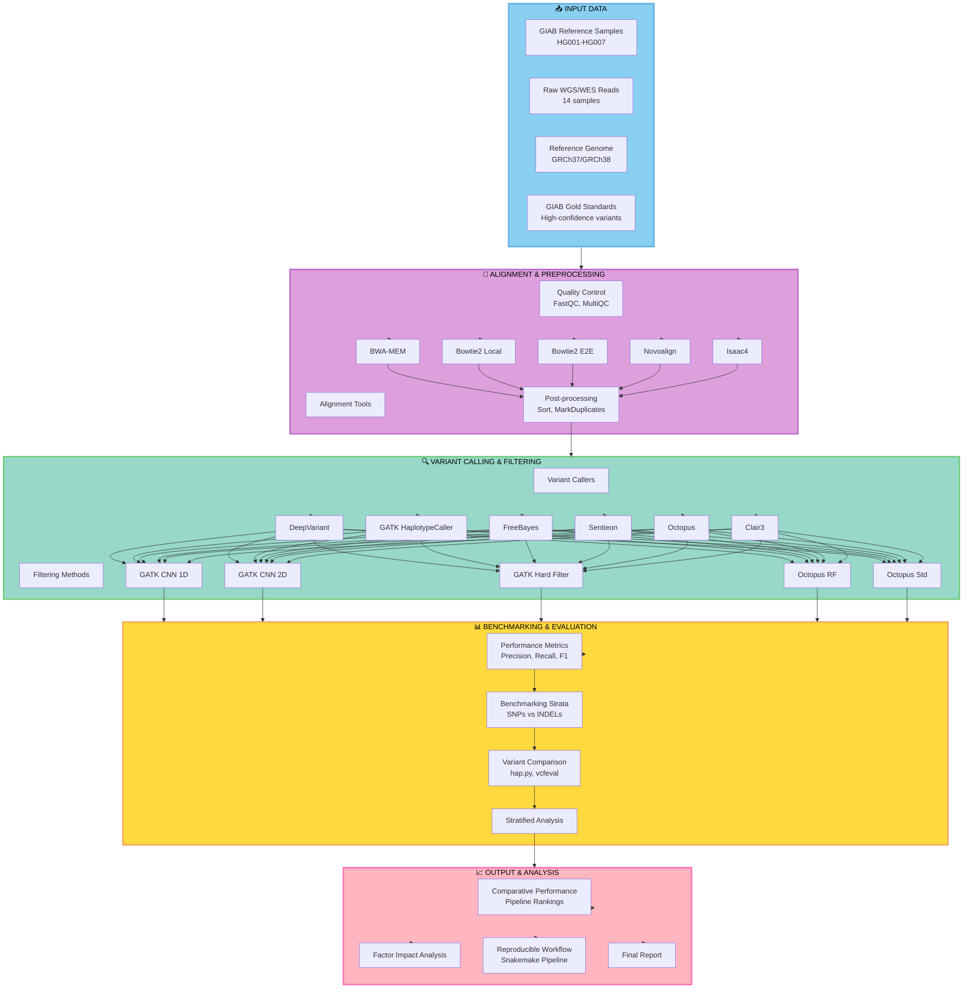

```
/scratch/islam.mdtar/vbench_group/README_TEAM.md
```
# Variant Calling Pipeline Workflow (Mermaid Version)



## Add this to your `pipeline.md` file

Copy the code above and paste it directly into your markdown file. GitHub will render it automatically!

### Simplified Text Version for README

Alternatively, add this ASCII diagram:

```
┌─────────────────────────────────────────────────────────────┐
│                    📥 INPUT DATA                            │
├─────────────────────────────────────────────────────────────┤
│  • GIAB Samples (HG001-HG007)                              │
│  • Raw WGS/WES Reads (14 samples)                          │
│  • Reference Genome (GRCh37/GRCh38)                        │
│  • GIAB Gold Standards                                      │
└────────────────────────┬────────────────────────────────────┘
                         │
                         ▼
┌─────────────────────────────────────────────────────────────┐
│           🧭 ALIGNMENT & PREPROCESSING                      │
├─────────────────────────────────────────────────────────────┤
│  Aligners: BWA-MEM | Bowtie2 (Local/E2E) | Novoalign      │
│  QC: FastQC, MultiQC                                       │
│  Post-processing: Sort, MarkDuplicates                     │
└────────────────────────┬────────────────────────────────────┘
                         │
                         ▼
┌─────────────────────────────────────────────────────────────┐
│         🔍 VARIANT CALLING & FILTERING                      │
├─────────────────────────────────────────────────────────────┤
│  Callers: DeepVariant | GATK HC | FreeBayes | Octopus     │
│  Filters: CNN 1D/2D | Hard Filters | Random Forest        │
└────────────────────────┬────────────────────────────────────┘
                         │
                         ▼
┌─────────────────────────────────────────────────────────────┐
│         📊 BENCHMARKING & EVALUATION                        │
├─────────────────────────────────────────────────────────────┤
│  Metrics: Precision, Recall, F1-Score                     │
│  Tools: hap.py, vcfeval                                    │
│  Strata: SNPs/INDELs, CDS, Coverage levels                │
└────────────────────────┬────────────────────────────────────┘
                         │
                         ▼
┌─────────────────────────────────────────────────────────────┐
│             📈 OUTPUT & ANALYSIS                            │
├─────────────────────────────────────────────────────────────┤
│  • Comparative Performance Rankings                        │
│  • Factor Impact Analysis                                  │
│  • Reproducible Snakemake Workflow                         │
│  • Final Benchmarking Report                               │
└─────────────────────────────────────────────────────────────┘
```
---

# ✅ **BINF6310 – Group 2 Shared HPC Workspace**

**Project:** Variant Calling Benchmark Reproduction
**Group Name:** `vbench_group`
**Members:**

* **islam.mdtar** (Team Lead)
* **alamoudi.r**
* **alimoradian.a**

---

# 📁 1. Workspace Location

Your group has a **shared working directory** on Explorer:

```
/scratch/islam.mdtar/vbench_group/
```

This folder is shared through **ACL permissions**, so all 3 members have full read/write/execute access.

---

# 📂 2. Folder Structure

Below is the official project structure (auto-created by `setup_group.sh`):

```
vbench_group/
│
├── raw_fastq/         # SRA FASTQ files (HG002 R1/R2)
│
├── reference/         # hg38 reference FASTA + BWA/Bowtie2 indexes
│
├── results/           
│   ├── fastqc/
│   ├── bwa/
│   └── bowtie2/
│
├── logs/              # SLURM logs
│
├── scripts/           # shared scripts (Snakemake, SLURM, QC)
│
└── variant-calling-benchmark/
    ├── data/
    ├── raw_fastq/
    ├── reference/
    ├── results/
```

---

# 🔐 3. Access Requirements for Members

To access the shared workspace, simply run:

```bash
cd /scratch/islam.mdtar/vbench_group
```

If you get **Permission denied**, run this test:

```bash
ls -ld /scratch/islam.mdtar
```

Expected permissions:

```
user::rwx
user:alamoudi.r:--x
user:alimoradian.a:--x
other::--x
```

If not, inform team lead (islam.mdtar).

---

# ⚙️ 4. Required Environment

Each member should activate the shared Conda environment:

```bash
conda activate vbench-env
```

Installed tools include:

* snakemake-minimal
* bwa
* samtools
* fastqc
* bioconda utilities

Check:

```bash
snakemake --version
bwa --version
fastqc --version
samtools --version
```

---

# 🚀 5. Workflow Overview (What each member works on)

### **Job 1 — FASTQC + Alignment (Lead: Tariq)**

Input:

```
raw_fastq/HG002_R1.fastq.gz
raw_fastq/HG002_R2.fastq.gz
```

Output goes to:

```
results/fastqc/
results/bwa/
```

### **Job 2 — Variant Calling (Lead: Raghad)**

Input:

```
results/bwa/HG002.sorted.bam
reference/Homo_sapiens_assembly38.fasta
```

Outputs:

```
results/gatk/
results/deepvariant/
```

### **Job 3 — Benchmarking (Lead: Atra)**

Compares called variants to truth set (GIAB).

Output:

```
results/benchmark/
```

---

# 🧪 6. Test Command for All Members

Run this to confirm access:

```bash
touch /scratch/islam.mdtar/vbench_group/logs/test_<USERNAME>.txt
ls /scratch/islam.mdtar/vbench_group/logs/
```

You should see your test file.

---


# 📜 7. SLURM Job Usage (Run Inside `scripts/`)

Example:

```bash
sbatch run_job1.slurm
```

Check job:

```bash
squeue -u <username>
```

Logs appear in:

```
logs/
```

---

# 🌐 8. Git Collaboration Guide

Clone the central repo:

```bash
cd vbench_group
git clone https://github.com/mtariqi/variant-calling-benchmark
```

Add your own branch:

```bash
git checkout -b raghad-job2
```

Push:

```bash
git push origin raghad-job2
```

---

# 📝 9. Expectations

✔ Use only shared directories
✔ Document every command in your personal script
✔ Commit all workflow progress to GitHub
✔ Save all results under `/results`
✔ Each member completes their assigned phase

---

# 🎉 10. Contact & Support

If you have HPC access issues, contact:

**Team Lead:**
📧 [islam.mdtar@northeastern.edu](mailto:islam.mdtar@northeastern.edu)

Or use the Canvas/HPC student support channel.


