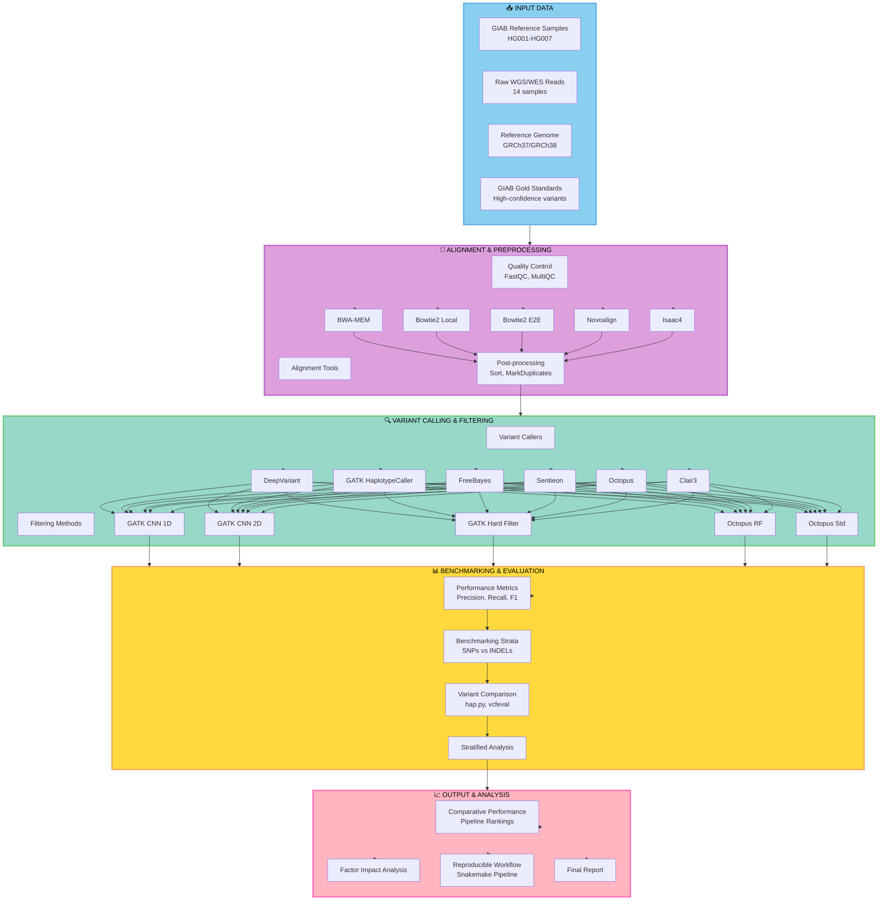

# Variant Calling Pipeline Workflow (Mermaid Version)




```
┌─────────────────────────────────────────────────────────────┐
│                    📥 INPUT DATA                            │
├─────────────────────────────────────────────────────────────┤
│  • GIAB Samples (HG001-HG007)                              │
│  • Raw WGS/WES Reads (14 samples)                          │
│  • Reference Genome (GRCh37/GRCh38)                        │
│  • GIAB Gold Standards                                      │
└────────────────────────┬────────────────────────────────────┘
                         │
                         ▼
┌─────────────────────────────────────────────────────────────┐
│           🧭 ALIGNMENT & PREPROCESSING                      │
├─────────────────────────────────────────────────────────────┤
│  Aligners: BWA-MEM | Bowtie2 (Local/E2E) | Novoalign      │
│  QC: FastQC, MultiQC                                       │
│  Post-processing: Sort, MarkDuplicates                     │
└────────────────────────┬────────────────────────────────────┘
                         │
                         ▼
┌─────────────────────────────────────────────────────────────┐
│         🔍 VARIANT CALLING & FILTERING                      │
├─────────────────────────────────────────────────────────────┤
│  Callers: DeepVariant | GATK HC | FreeBayes | Octopus     │
│  Filters: CNN 1D/2D | Hard Filters | Random Forest        │
└────────────────────────┬────────────────────────────────────┘
                         │
                         ▼
┌─────────────────────────────────────────────────────────────┐
│         📊 BENCHMARKING & EVALUATION                        │
├─────────────────────────────────────────────────────────────┤
│  Metrics: Precision, Recall, F1-Score                     │
│  Tools: hap.py, vcfeval                                    │
│  Strata: SNPs/INDELs, CDS, Coverage levels                │
└────────────────────────┬────────────────────────────────────┘
                         │
                         ▼
┌─────────────────────────────────────────────────────────────┐
│             📈 OUTPUT & ANALYSIS                            │
├─────────────────────────────────────────────────────────────┤
│  • Comparative Performance Rankings                        │
│  • Factor Impact Analysis                                  │
│  • Reproducible Snakemake Workflow                         │
│  • Final Benchmarking Report                               │
└─────────────────────────────────────────────────────────────┘
```
